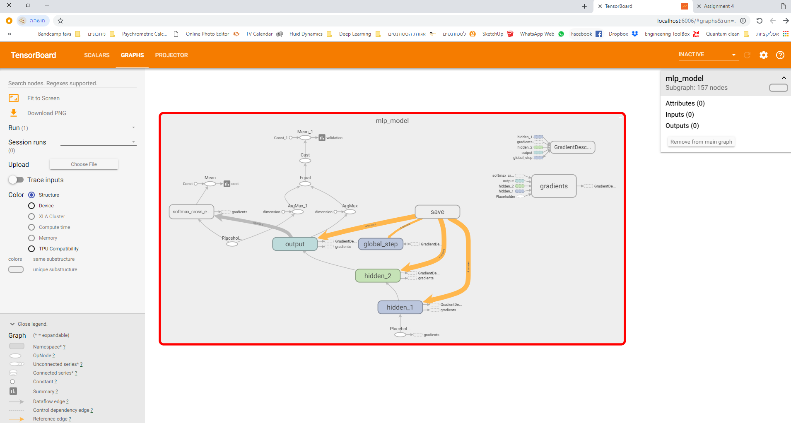
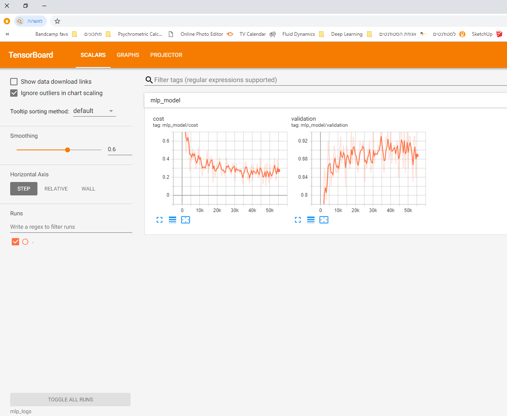

# Assignment 4

### Part 3 Images




### Part 5: Brief Write Up

  - Logistic regression with 100 epochs:
  ```sh
Epoch: 0100 cost = 0.282141806
Validation Error: 0.07660001516342163
Optimization Finished!
Test Accuracy: 0.9214
```
  - Original (two hidden layers) multilayer perceptron with 1000 epochs:
  ```sh
  Epoch: 1000 cost = 0.000466205
Validation Error: 0.01759999990463257
Optimization Finished!
Test Accuracy: 0.98
  ```
- Original (two hidden layers) multilayer perceptron with 100 epochs:
```sh
Epoch: 0100 cost = 0.282158803
Validation Error: 0.0745999813079834
Optimization Finished!
Test Accuracy: 0.9223
```
- Modified (one hidden layer) multilayer perceptron with 100 epochs
 ```sh
 Epoch: 0100 cost = 0.524606975
Validation Error: 0.20920002460479736
Optimization Finished!
Test Accuracy: 0.7862
  ```
  
- *Did running many more (1,000 vs 100) epochs yield better or worse results for the original multilayer perceptron?*

The 1000 epoches session resulted in 6% increase in the learning success!
- *Did the multilayer pereceptron do better or worse than logistic regression when you ran them both for 100 epochs?*

No, both of them resulted in 92% success.
- *Did decreasing the number of hidden layers reduce the success of the multilayer perceptron?*

Yes! When I used 2 layers the test accuracy was around 92%, 1 layer reduced the accuracy to 78% - **14% less** for the same amount of epochs.
- *What general lesson might you deduce from your answers to these three questions?*

We have multiple options in increasing the success of our model, we can increase iterations (should always plot the error trend to determine when we hit the critical point where the error does not reduce anymore - so no point of wasting more time on iterations), we can add layers or we can even try a different approaches! (Moving from regression to perceptron learning).
